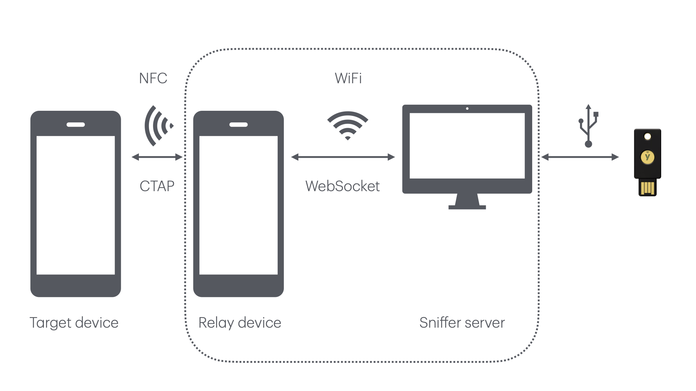

# ctap-nfc-sniffer

A simple Android-based sniffer for CTAP messages over NFC transport.

This prototype sniffer (or protocol analyzer, but that sounds a bit pretentious for this proof-of-concept) consists of two parts:

1. An Android app that uses Host Card Emulation to present itself as a FIDO security key, relaying APDUs to a websockets server.
2. A Python websockets server, relaying APDUs to a connected FIDO security key

In a diagram:




# Build and run the Android application

Build the app using Gradle:

	./gradlew build

Make sure your device is listed:

	adb devices

(you may need to extend your PATH with Android platform tools, e.g. ~/Library/Android/sdk/platform-tools/).

Install the app on your device:

	./gradlew installDebug

Observe log messages:

	adb logcat

Consider filtering on this app's process ID. Look for nl.joostd.hcewebsocketrelay in `adb shell ps`.

# Install and run the Python server

Install a virtual environment

	python3 -m venv venv

Activate your environment

	. venv/bin/activate

Install dependencies

	pip install fido2 websockets pyscard

Run the server

	./server.py

# Observe APDUs exchanged

Example:

```
>>> 00a4040008a0000006472f0001
<<< 5532465f5632 90 00
>>> 801000000104
<<< 00b8180185665532465f5632684649444f5f325f306c4649444f5f325f315f505245684649444f5f325f31684649444f5f325f3202886b6372656450726f746563746b686d61632d7365637265746c6c61726765426c6f624b65796863726564426c6f626c6d696e50696e4c656e6774686e686d61632d7365637265742d6d6371746869726450617274795061796d656e74647369676e0350f8a011f38c0a4d15800617111f9edc7d04ae626570f562726bf5627570f564706c6174f468616c776179735576f468637265644d676d74f569617574686e72436667f569636c69656e7450696ef56a6c61726765426c6f6273f56d706572437265644d676d7452 61 00
>>> 00c00000
<<< 4ff56e70696e557641757468546f6b656ef56f7365744d696e50494e4c656e677468f5706d616b654372656455764e6f74527164f57563726564656e7469616c4d676d7450726576696577f5051906000682020107080818800982636e6663637573620a83a263616c672664747970656a7075626c69632d6b6579a263616c672764747970656a7075626c69632d6b6579a263616c67382264747970656a7075626c69632d6b65790b1910000cf40d040e010f182010011418601682667061636b6564646e6f6e651818f518195820cd48bc98a751b4d6b599c2f3df09e6a45941f3736c0da2115e864dd0be647203181a8163757362181bf5181c5368747470 61 13
>>> 00c00000
<<< 733a2f2f6578616d706c652e636f6d181d183f 90 00
>>> 00a4040008a0000006472f0001
<<< 5532465f5632 90 00
```
